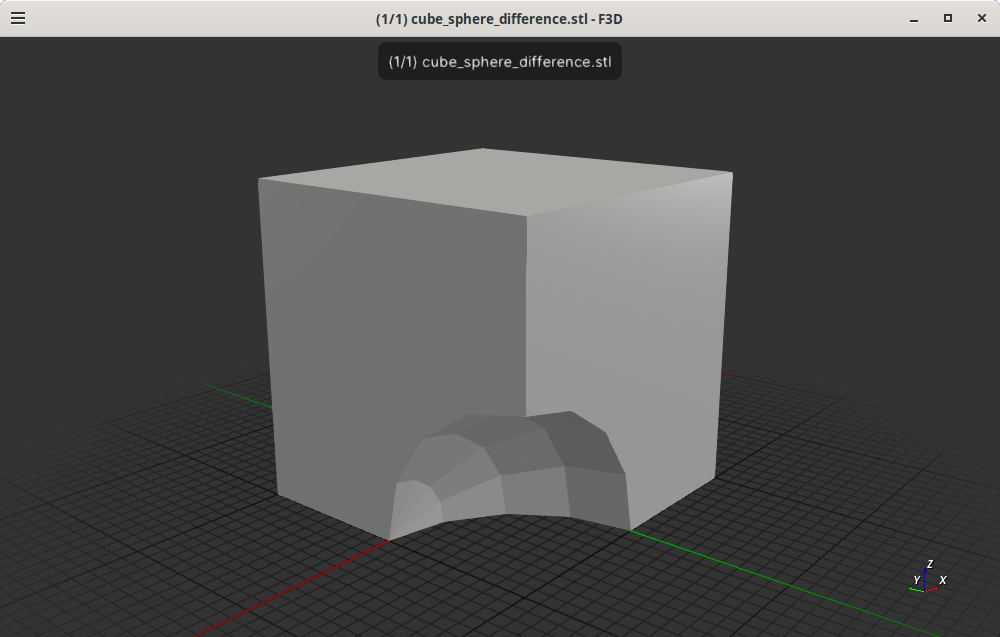
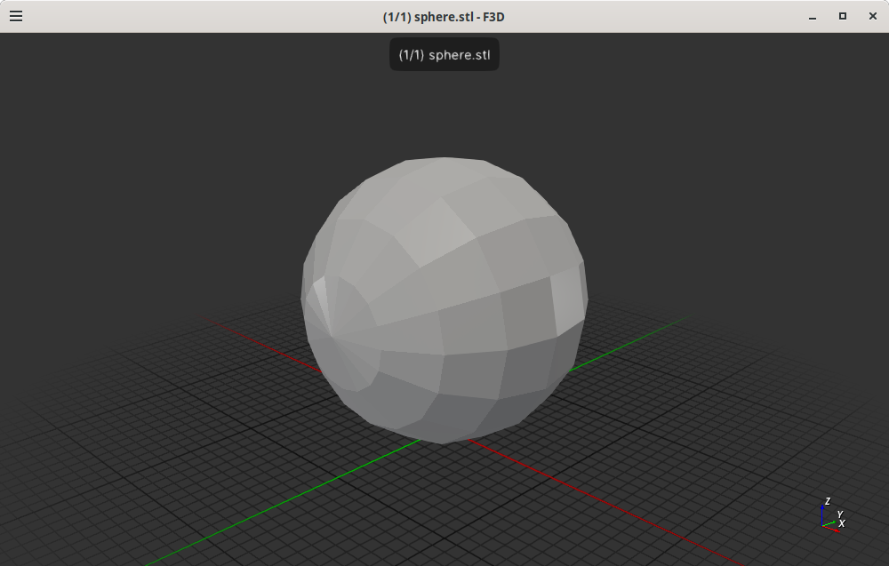
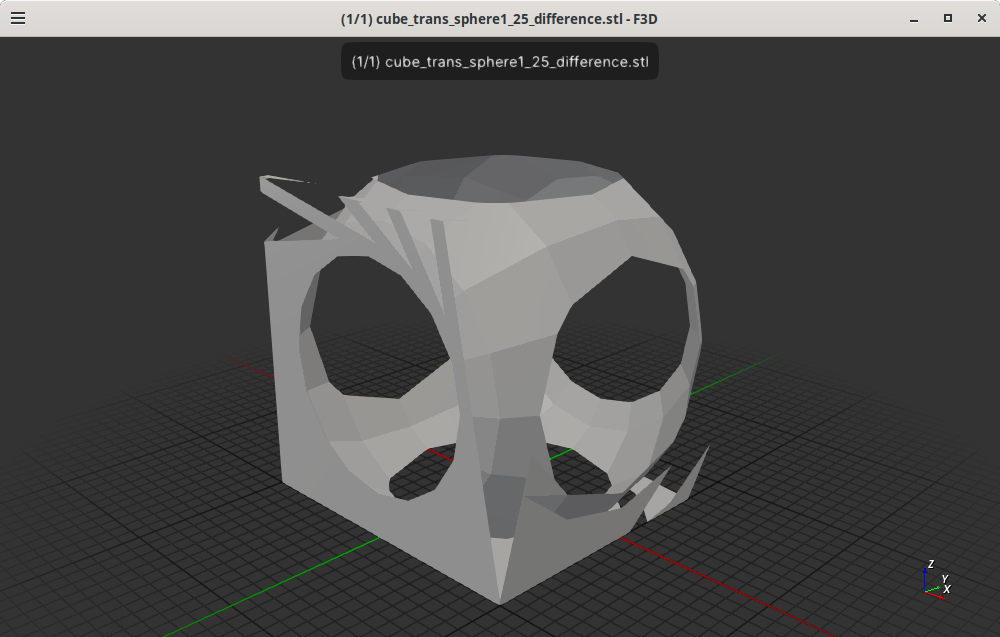

# Cad Experiment csgrs example 1

This is example 1 currently from the csgrs the code is:
```rust
fn main() {
    // Alias the library’s generic CSG type with empty metadata:
    type CSG = csgrs::csg::CSG<()>;

    // Create two shapes:
    let cube = CSG::cube(2.0, 2.0, 2.0, None);  // 2×2×2 cube at origin, no metadata
    let sphere = CSG::sphere(1.0, 16, 8, None); // sphere of radius=1 at origin, no metadata

    // Difference one from the other:
    let difference_result = cube.difference(&sphere);

    // Write the result as an ASCII STL:
    let stl = difference_result.to_stl_ascii("cube_minus_sphere");
    std::fs::write("cube_sphere_difference.stl", stl).unwrap();
}
```

The resulting file is `cube_sphere_difference.stl`. I then used used `f3d cube_sphere_difference.stl` to view the file and the result is shown below:



I then modifed the file so only the sphere is shown and the code is:
```rust
fn main() {
    // Alias the library’s generic CSG type with empty metadata:
    type CSG = csgrs::csg::CSG<()>;

    // Create two shapes:
    let cube = CSG::cube(2.0, 2.0, 2.0, None);  // 2×2×2 cube at origin, no metadata
    let sphere = CSG::sphere(1.0, 16, 8, None); // sphere of radius=1 at origin, no metadata
    //let stl = sphere.to_stl_ascii("sphere");
    //std::fs::write("sphere.stl", stl).unwrap();
u
    // Difference one from the other:
    let difference_result = cube.difference(&sphere);

    // Write the result as an ASCII STL:
    let stl = difference_result.to_stl_ascii("cube_minus_sphere");
    std::fs::write("cube_sphere_difference.stl", stl).unwrap();
}
```



The comment for the `let sphere = ..` says `// shpere of radius=1 at the origin`
that is not the case from my perspective based on the x, y, z axis I see in the
cube_sphere_difference.stl rendering.


But now I believe the axises as displayed by f3d is wrong and I modified the code
to transate the sphere into a position that should place the sphere in the center
of the cube, the code is:

```rust
use nalgebra::Vector3;

fn main() {
    // Alias the library’s generic CSG type with empty metadata:
    type CSG = csgrs::csg::CSG<()>;

    // Create two shapes:
    let cube = CSG::cube(2.0, 2.0, 2.0, None);  // 2×2×2 cube at origin, no metadata
    let sphere1_25 = CSG::sphere(1.25, 16, 8, None); // sphere of radius=1 at origin, no metadata
    let trans_sphere1_25 = sphere1_25.translate(Vector3::new(1.0, 1.0, 1.0));

    // Difference one from the other:
    let difference_result = cube.difference(&trans_sphere1_25);

    // Write the result as an ASCII STL:
    let stl = difference_result.to_stl_ascii("cube_minus_trans_sphere1_25");
    std::fs::write("cube_trans_sphere1_25_difference.stl", stl).unwrap();
}
```

The intent is to recreate the a cube with holes in the faces as shown
in `cgrs`'s `README.md` file. Kinda worked but not quite:




## License

Licensed under either of

- Apache License, Version 2.0 ([LICENSE-APACHE](LICENSE-APACHE) or http://apache.org/licenses/LICENSE-2.0)
- MIT license ([LICENSE-MIT](LICENSE-MIT) or http://opensource.org/licenses/MIT)

### Contribution

Unless you explicitly state otherwise, any contribution intentionally submitted
for inclusion in the work by you, as defined in the Apache-2.0 license, shall
be dual licensed as above, without any additional terms or conditions.
