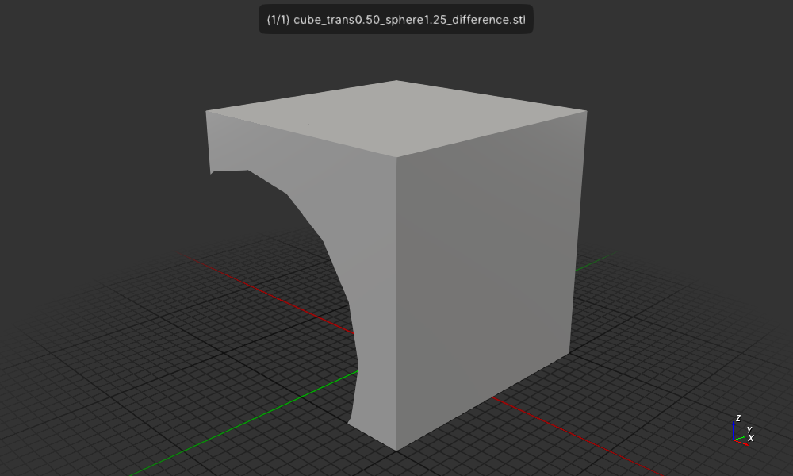

# Cad Experiment csgrs example 1

Change the code to take the sphere_trans and sphere_radius
from the command line so we can easily test various values.

```rust
use std::env;

use nalgebra::Vector3;

fn main() {
    // Alias the library’s generic CSG type with empty metadata:
    type CSG = csgrs::csg::CSG<()>;

    let args: Vec<String> = env::args().collect();
    let sphere_trans = args[1].parse::<f64>().unwrap();
    let sphere_radius = args[2].parse::<f64>().unwrap();

    // Create two shapes:
    let cube = CSG::cube(2.0, 2.0, 2.0, None);  // 2×2×2 cube at origin, no metadata
    let sphere = CSG::sphere(sphere_radius, 16, 8, None); // sphere of radius=1 at origin, no metadata
    let trans_sphere = sphere.translate(Vector3::new(sphere_trans, sphere_trans, sphere_trans));

    // Difference one from the other:
    let difference_result = cube.difference(&trans_sphere);

    // Write the result as an ASCII STL:
    let name = &format!("cube_trans{:0.2}_sphere{:0.2}", sphere_trans, sphere_radius);
    let stl = difference_result.to_stl_ascii(name);
    std::fs::write(name.to_owned() + "_difference.stl", stl).unwrap();
}
```

## Usage

The Cargo.toml file has 3 ways to depend on `csgrs`:
  * Using no features it will use the crates.io version 0.15.2 of `csgrs`
  * using --features csgrs-local it will use a local version `csgrs`
  at `/home/wink/data/prgs/rust/forks/csgrs`
  * using --features csgrs-git it will use the git version
  from https://github.com/winksaville/csgrs.git, i.e. my repo
5 examples:

```
cargo run --features csgrs-git -- 0.00 1.00
f3d cube_trans0.00_sphere1.00_difference.stl --output cube_trans0.00_sphere1.00_difference.stl.png
```


```
cargo run --features csgrs-git -- 0.00 1.00
f3d cube_trans0.00_sphere1.25_difference.stl --output cube_trans0.25_sphere1.00_difference.stl.png
```


```
cargo run --features csgrs-git -- 0.10 1.25
f3d cube_trans0.10_sphere1.25_difference.stl --output cube_trans0.10_sphere1.25_difference.stl.png
```


```
cargo run --features csgrs-git -- 0.50 1.25
f3d cube_trans0.50_sphere1.25_difference.stl --output cube_trans0.50_sphere1.25_difference.stl.png
```


```
cargo run --features csgrs-git -- 1.00 1.25
f3d cube_trans1.00_sphere1.25_difference.stl --output cube_trans1.00_sphere1.25_difference.stl.png
```

 

## License

Licensed under either of

- Apache License, Version 2.0 ([LICENSE-APACHE](LICENSE-APACHE) or http://apache.org/licenses/LICENSE-2.0)
- MIT license ([LICENSE-MIT](LICENSE-MIT) or http://opensource.org/licenses/MIT)

## Contribution

Unless you explicitly state otherwise, any contribution intentionally submitted
for inclusion in the work by you, as defined in the Apache-2.0 license, shall
be dual licensed as above, without any additional terms or conditions.
